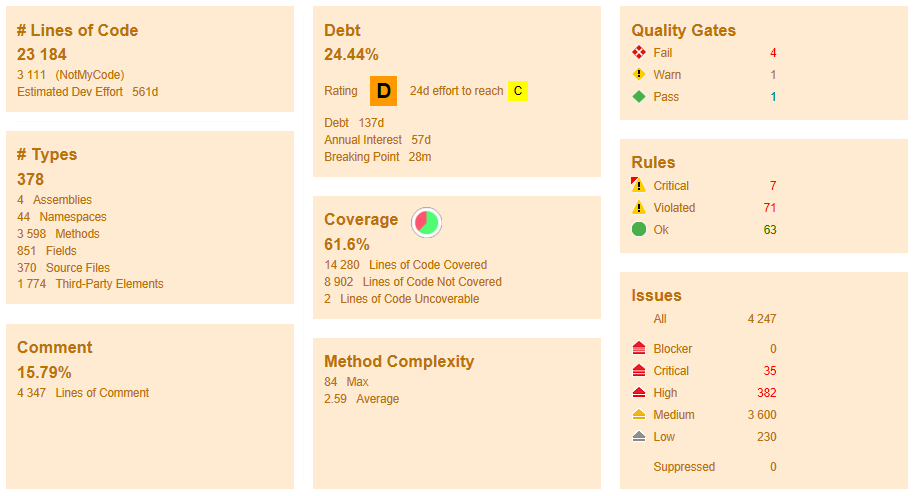
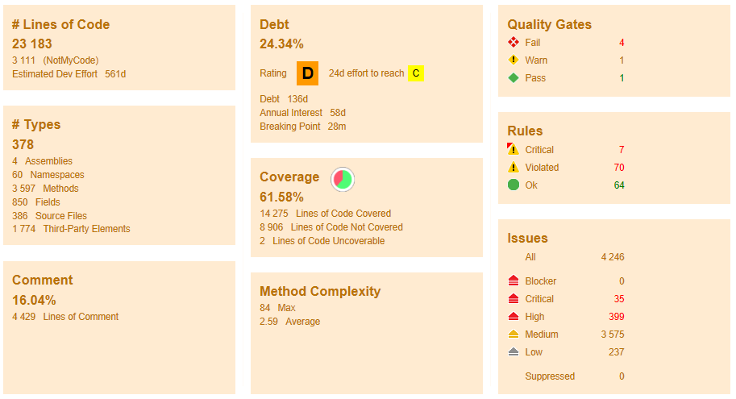

<!--- Create a pdf out of this document by running the command:
      
      pandoc template.md --pdf-engine=pdflatex -o template.pdf
      
      This requires (on windows machines) to have installed:
      * MikTeX
      * Pandoc
      -->

<!--- this is a comment -->
<!--- Creating some colors here that we can refer to. -->
\definecolor{r}{HTML}{FFAAA5}
\definecolor{g}{HTML}{DCEDC1}
\definecolor{y}{HTML}{FFE8D4}

The following overview has been created as part of issue D3DFMIQ-858: Refine 
D-Flow FM plugin structure. We primarily focused on detangling the 
`WaterFlowFMModel` class by dividing the logic over multiple partial classes. No
significant refactoring was done, as any changes are largely dependent on the
`RHU` project. 
First, the good aspects will be discussed in this report and in the second 
section the challenges will be explained in detail. Furthermore, an NDepend 
report is generated to show the status of the code and finally in the last 
section recommendations will be suggested.  

# 1. Good aspects

Before the challenges will be discussed, it is important to note the good aspects 
of the code. Users are content with the functionalities of the D-Flow FM plugin. Therefore, it is 
important to refactor this plugin carefully, so that all these functionalities will
remain. 

Another good aspect is that the majority of the actual implementations of the domain concepts 
are within the Hydro project (which is not evaluated within this report).

# 2. Challenges

In this section the main challenge, the additional implementation wide challenges and the
remaining specific challenges of the D-Flow FM plugin will be discussed in detail.

## 2.1 Main challenge: Solving the root cause of the majority of problems

The root cause of the majority of problems within D-Flow FM plugin is the poor
separation of concerns. Due to this the several conceptual layers within a
software program are mixed. This leads to unnecessary complexity and 
dependencies, technical debt, and a large number of B&O issues. This mixing
of layers is a result of assigning too many responsibilities to a small number
of classes. As a result these classes have taken on godlike proportions within
the plugin. This accumulation of responsibilities seems to be a gradual 
development over the lifetime of the D-Flow FM plugin. Too often an approach of
fixing things quickly with minor modifications has been chosen over evaluating
whether the current architecture is still adequate. Because adding another 
responsibility to a class is generally easier than reevaluating the complete
architecture, especially when such an architecture is not properly documented, this
seems to have been the default approach. This makes sense from the perspective
of single issues, however, this will drag the development down over time. 

Given this root cause, the following concerns are not separated: 
\newpage

\footnotesize

| Component                              | Place                                                  |
|----------------------------------------|--------------------------------------------------------|
| \cellcolor{g} Model Layer              | \cellcolor{g} WaterFlowFMModel class and Hydro Project |
| \cellcolor{r} Model Layer-Spatial Data | \cellcolor{r} WaterFlowFMModel class                   |
| \cellcolor{r} Eventing                 | \cellcolor{r} WaterFlowFMModel class                   |
| \cellcolor{r} Save                     | \cellcolor{r} WaterFlowFMModel class and File classes  |
| \cellcolor{r} Open                     | \cellcolor{r} WaterFlowFMModel class and File classes  |
| \cellcolor{r} Export                   | \cellcolor{r} WaterFlowFMModel class and File classes  |
| \cellcolor{r} Import                   | \cellcolor{r} WaterFlowFMModel class and File classes  |
| \cellcolor{r} Running                  | \cellcolor{r} WaterFlowFMModel class                   |
| \cellcolor{r} Restart                  | \cellcolor{r} WaterFlowFMModel class and framework     |

\normalsize

\scriptsize

| Color         | Meaning                               |
|---------------|---------------------------------------|
| \cellcolor{g} | Not problematic.                      |
| \cellcolor{r} | Will require refactoring to separate. |

\normalsize

### 2.1.1 WaterFlowFMModel class

The main problem of the D-Flow FM plugin is the `WaterFlowFMModel` class. It 
consists of approximately 5000 lines of code, and is responsible for almost
everything related to the D-Flow FM plugin.

The following partial classes based upon these responsibilities have been
created:

* `WaterFlowFMModel.DimrModel`
* `WaterFlowFMModel.Eventing`
* `WaterFlowFMModel.FileBased`
* `WaterFlowFMModel.FileStructure`
* `WaterFlowFMModel.IO.Export`
* `WaterFlowFMModel.IO.Import`
* `WaterFlowFMModel.Output.Connecting`
* `WaterFlowFMModel.Output.Data`
* `WaterFlowFMModel.Output.Saving`
* `WaterFlowFMModel.Restart`
* `WaterFlowFMModel.Running`
* `WaterFlowFMModel.Spatial`
* `WaterFlowFMModel.TDMB`

\normalsize

Splitting this class into partial classes, each with a specific responsibility
was only a first step to discover the different responsibilities.
Not every aspect can be split based on its functionality, as multiple methods
are used for different functionalities. Therefore, it is desired
to split these methods first, after which separate classes can be created for
each responsibility. An good example is the `ExportTo` method, which takes care of saving 
and exporting a model. Due to this, this method is very complex by using different input 
arguments and if statements to satisfy all requirements for all the different situations. 

#### Consequences of the implementation of ModelBase and TimeDependentModelBase \newline

The `ModelBase` and `TimeDependentModelBase` are classes provided by the DeltaShell framework 
and the `WaterFlowFMModel` class uses these classes. Due to this implementation we face:

* Forced responsibilities and potentially unnecessary complexity
* Significant reliance on `DataItems` ($\Rightarrow$ complexity of properties and
  code size).
* Significant reliance on inheritance ($\Rightarrow$ low cohesion and additional 
  complexity).

`DataItems` are objects existing in all plugins and over time their responsibilities 
increased varying from saving parameters till sharing parameters between different
models. Since the `WaterFlowFMModel` is file-based, there is little reliance on `DataItems`
for saving purposes. However, they are also used to couple models, work with spatial
operations, during merging, and for restart files.

There are known issues with several of these operations.A clear choice needs to
be made for what and how the data items should be used within D-Flow FM plugin. 
This would solve several of our problems, and prevent future problems.

### 2.1.2 File classes

The entry point for the IO operations is the `WaterFlowFMModel`, however a large 
section of the actual logic is located within the different `File` classes. These
`File` classes suffer from similar problems as the `WaterFlowFMModel` class. They 
contain more than 1000 lines of code, and have accumulated a large number of 
responsibilities. This violates the single responsibility principle. 

The following classes stand out in particular due to their complexity:

* `MduFile`
* `ExtForceFile`
* `StructuresFile`

Currently, these classes contain the logic for both reading, writing and backwards compatibility. 
The backwards compatibility code is needed when properties in files get a new name and we want to 
support old model files. The logic to support this backwards compatibility is spread out over the
different `File` classes. It requires a large number of if-else statements to behave correctly
making the code more complex.
Furthermore, a large portion of the logic of these file classes is currently private within these classes, 
making it hard to test and reuse. This reduces cohesion within these classes. Most of these private methods are 
responsible for writing a certain aspect of the file corresponding with the `File` class. 
In order to improve cohesion, these functions should be extracted and publicly exposed. 
This would also improve the ease of testing. Finally, documentation should be added
to these functions, explaining their expectations and responsibilities.

Each of these classes will be discussed in further detail. This does not mean the other 
classes do not need refactoring, however the priority is a lot lower.

#### MduFile \newline

As mentioned before, the `MduFile` is both responsible for reading and writing
mdu files. However, due to the mdu file being the master definition file, it has
been assigned a coordinating/managing role within the IO processes. 

For writing it has the following responsibilities:

* Ensure that the `NetFile` is copied and updated with bathymetry and coordinates.
* Ensure that all other files referenced by the mdu but not written in the GUI 
  are copied.
* Ensure that all other `File` classes are called.
* Write the mdu file and the properties itself, by interacting with the file system.

For reading it has the following responsibilities:

* Reading the mdu file and the contained properties itself, by interacting with
  the file system, and interpreting the values. This includes some backward
  compatibility, by mapping values to newer values and keeping unknown properties.
* Setting all the output time properties.
* Ensuring that all other `File` read classes are called.

This set of responsibilities is too large, and violates the single responsibility 
principle. In order to improve the separation of concerns, each of these 
responsibilities should be extracted. This would improve testing, and makes the
code more extensible. A more in-depth description of how this class could be
subdivided is given in the details section of steps forward.

#### ExtForceFile \newline

The `ExtForceFile` is divided over a main class, and a helper class. The 
`ExtForceFile` serves as the main entry point, however the actual logic is 
divided among both the `ExtForceFile` and its helper. Without a clear 
separation of responsibility, it is not completely clear where logic is 
currently located.

For write it has the following responsibilities:

* Write the `ExtForceFile` itself.
* Write all subfiles of the `ExtForceFile`.
* Write any unknown quantities.

For read it has the following responsibilities:

* Read the `ExtForceFile`.
* Read the subfiles.
* Parse unknown quantities.

The write and read steps consists of writing multiple parts, which are currently
either private, or located within the helper class. The responsibilities of the 
`ExtForceFile` should be more clearly defined, and the supporting logic should 
be extracted clearly. This would make the `ExtForceFile` significantly more 
readable, and thus easier to maintain.

#### StructuresFile \newline

The `StructuresFile` is responsible for reading and writing all (2D) structures
within the D-Flow FM plugin. Besides this it also handles backward compatibility.
Because it is responsible for writing each structure. This logic is implemented
in private methods. This functionality should be exposed. Furthermore, the 
current implementation relies a lot on determining the type, and then performing
a certain action. This means there are quite extensive if trees / switch 
statements. This could be simplified by extracting the logic dealing with 
different structures into separate classes, and injecting them depending on the
type once.

### 2.1.3 Creating Data Access Layer for separating concerns 

As mentioned before a large part of the current B&O issues are a result of the
mixing of different conceptual layers. 
In order to create a clear separation of concerns, the Data Access Layer should 
be separated from the Model Layer. Such that within the Model Layer, 
all data is stored that is necessary for our application to function. The layout of memory 
should be completely independent of file structures and such requirements. 
The Data Access Layer is used to transfer the File System representation to the
Model Layer and vice versa. 

Because these two are currently not separated, changes in the file format ripple through
in the model layer, and changes in the model layer might break the io operations.
This creates additional complexity, technical debt etc. 

To create a clearly distinct Data Access Layer the `WaterFlowFMModel` and `File` classes need to 
be refactored.

## 2.2 Additional implementation wide challenges

Besides these functional challenges, there are also several problems which are
present throughout the D-Flow FM plugin. These problems should be addressed 
while fixing the functional challenges.

### 2.2.1 Classes are used for purposes beyond their original purpose

Several classes within the D-Flow FM plugin are used way beyond their original
scope. Due to this, the different responsibilities in these classes increased 
and it becomes harder to satisfy the set of requirements from both use cases. 
An example of this behaviour is the `ModelProperty` class. 
It is used to store information about the model, but it is also used as a
temporary data access object. These are two separate requirements that should not be 
coupled like this. This in turn makes it harder to move classes to different locations
and creates unnecessary dependencies.

### 2.2.2 Different implementations for similar issues

On the other hand, the D-Flow FM plugin can be improved by using the same implementations for solving
the same type of issues.  

A good example is the implementation of model properties that are not supported by the GUI.
Different `File` classes handle these in different ways. During the import we want to put them in the memory of the program, 
then do nothing with this information and during an export we want to write these model properties, 
so that the kernel can calculate with these properties. For some files, these unknown properties 
for the GUI are stored in separate objects in the model. However, other file types are using another 
approach and add these unknown properties for the GUI to the big list of supported properties with 
special tags. Refactoring is needed for a generic solution, so that the code is less complex.

## 2.3 Remaining specific challenges of the FlowFM plugin

The following specific challenges were encountered during B&O issues.

### 2.3.1 FM Common project

The D-Flow FM plugin is split into a FM specific part `FMSuite.FlowFM` and a shared part 
`FMSuite.Common`, which can be used by other plugins, likes Waves.
Both parts have their own project and an additional project for the different GUI windows they use. 
Therefore, the D-Flow FM plugin has four projects in total.  

In the `FMSuite.Common` project the read and write logic for 2D structures is stored.
The logic for reading and writing 1D structures is located in the `NGHS.IO` project. However,
the concepts for both 1D and 2D are stored within a single project, the `Hydro` project. 
This inconsistency in location of the logic is confusing for developers, and should 
be arranged in a consistent way.

### 2.3.2 Snapped features

For retrieving the snapped geometries of features, a call to the kernel will be made. If the result
is not what we expect, a separate call for each of the features will be made. 
This approach is error prone and at times will link snapped geometries to the wrong features.

### 2.3.3 WeirviewModel class

The final challenge is about the structures window. The Model-View-ViewModel 
principle has been used for developing this window. However, the ViewModel is not implemented correctly in 
the past. Due to this, it is difficult to change anything, even if it is just a minor modification. Also 
due to its high complexity, it is easy to create memory leaks. 

\newpage
# 3. NDepend

The NDepend report was generated with: 

\footnotesize

* `FMSuite.Common.dll` 
* `FMSuite.Common.Gui.dll` 
* `FMSuite.FlowFM.dll` 
* `FMSuite.FlowFM.Gui.dll` 

\normalsize

It was run with default settings. No baseline was 
selected. The before run was created with the code of revision 43404 of the B&O line. The 
after results were created with revision 43694.
For both before and after a code coverage was created. For the full report 
see issue D3DFMIQ-983.

## Before code update
<!--- This adds an image, the first value should be the name of the image file,
      placed within the directory. Without a valid image it will not render it.-->
      
{ width=85% }

## After code update
<!--- This adds an image, the first value should be the name of the image file,
      placed within the directory. -->
{ width=85% }

<!--- More LaTeX magic -->
\newpage
# 4. Steps forward
## 4.1 Overview

Solving the main challenge, which is the the root cause of the majority of problems, has the 
highest priority for improving the D-Flow FM plugin and therefore the following steps are advised.

1. Separate the Data Access Layer
2. Refactor `WaterFlowFMModel` class
3. Refactor `File` classes in the D-Flow FM plugin

## 4.2 Separate the Data Access Layer

As already discussed in section 2.1.3, creating a Data Access Layer will help by separating the different concerns and should 
be the first step. Most of the work should be done in the `WaterFlowFMModel` class and `File` classes.

## 4.3. Refactor WaterFlowFMModel class

To separate the Data Access Layer the following partial classes of the `WaterFlowFMModel` class
can be used:

* `WaterFlowFMModel.FileBased`
* `WaterFlowFMModel.FileStructure`
* `WaterFlowFMModel.IO.Export`
* `WaterFlowFMModel.IO.Import`
* `WaterFlowFMModel.Output.Connecting`
* `WaterFlowFMModel.Output.Data`
* `WaterFlowFMModel.Output.Saving`

However, a missing Data Access Layer is not the only problem for the `WaterFlowFMModel` class. 
It is also important to decide what to do with `ModelBase` and `TimeDependentModelBase` classes 
from the framework and its Data Items.
If `DataItems` are kept, their management should at least be exposed as a separate object, which the different components 
make use of. This way, the way the objects are stored in memory can be decoupled from the way they are accessed.
If `DataItems` are not kept the storage of some model information, like spatial operations, should be adjusted. Also 
the way how models can be coupled to other models should be re-designed.

## 4.4 Refactor File classes in the D-Flow FM plugin

As already mentioned, the `MduFile`, `ExtForceFile` and `StructuresFile` are suggested
to refactor first, since there are significant problems with these `File`-classes. This reduces maintainability
and it is the source of a large number of issues. As mentioned before, this problem 
stems on one hand from a close coupling of components which should be independent
(model layer and Data Access Layer). Furthermore, the architectural choice along the
years seems to have been to extend the different io classes, without any regard for
their responsibilities. This in turn made the different `File` classes aggregate 
responsibilities.

These problems manifest itself mostly in the `WaterFlowFMModel` (mixing of layers)
and the `MduFile`. If we would split the responsibilities of the `MduFile`, the 
following steps could be taken. The `MduFile` should be split in a read
and a write part, as should be done for the other `File` classes. 
Both read and write classes could be further subdivided into at least 3 components.
This would again improve cohesion, and create a clearer separation of responsibilities.

Within the `MduFile` the following components can be identified:

* One manager or director class which is responsible for calling all the 
  appropriate subclasses in the right order. It should have minimal logic, and 
  at most some properties which are used to configure the overall behaviour. 
* One helper class that is responsible for the net-file management.
* One helper class that is responsible for managing the files which are not 
  written by the GUI.
* One class that is responsible for writing the `.mdu` file. 

