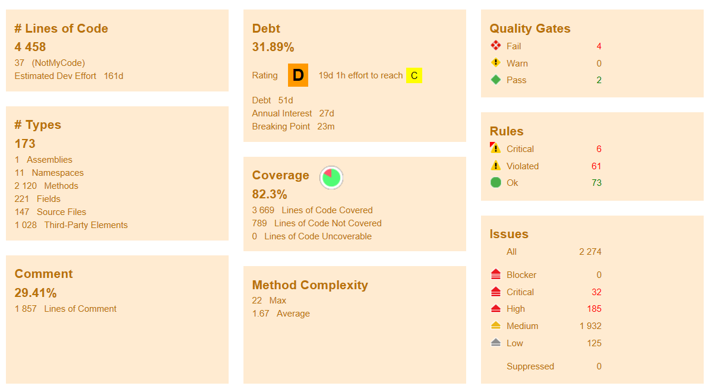
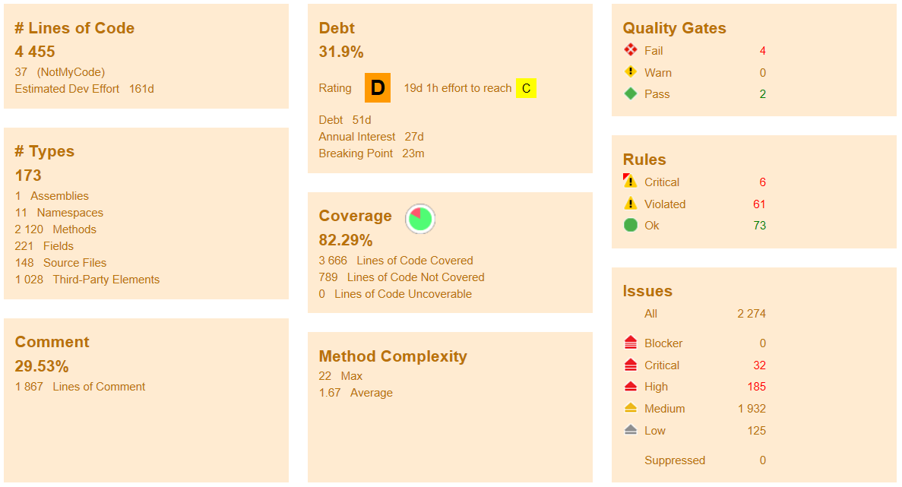

\definecolor{r}{HTML}{FFAAA5}
\definecolor{g}{HTML}{DCEDC1}
\definecolor{y}{HTML}{FFE8D4}

The following overview has been created as part of issue D3DFMIQ-959: Refine
`DelftTools.Hydro`. On first inspection of the code, the overall state of 
`DelftTools.Hydro` seemed to be decent. Therefore, we only performed a code 
clean up with ReSharper, and put the eventing of the Network class in a separate
file. Further refactorings could follow from the architectural overview created
by Hidde Elzinga, or as a result of the demand of either the `RHU` line or 
`B&O` line.

# Components
`DelftTools.Hydro` describes the more generic domain concepts shared within the
D-Hydro suite among the different plugins. We looked at this project as a 
follow-up from issue D3DFMIQ-857, `WaterFlowModel1D` class investigation. The 
`WaterFlowModel1D` plugin makes use of the concepts provided by `DelftTools.Hydro`. 

## Functional Subdivision
\footnotesize
| Component                 | Place                                             |
|---------------------------|---------------------------------------------------|
| \cellcolor{g} Model Layer | \cellcolor{g} Concepts                            |
| \cellcolor{g} Eventing    | \cellcolor{g} HydroRegion/Network related classes |
| \cellcolor{y} Save / Load | \cellcolor{y} NHibernate                          |
| \cellcolor{r} GUI         | \cellcolor{r} Attributes on properties            |
| \cellcolor{r} Export      | \cellcolor{r} Attributes on properties            |
| \cellcolor{r} Undo / Redo | \cellcolor{r} Attributes on properties            |
\normalsize

\scriptsize
| Color         | Meaning                             |
|---------------|-------------------------------------|
| \cellcolor{g} | Not problematic.                    |
| \cellcolor{y} | Will change but clearly separated.  |
| \cellcolor{r} | Will require refactoring to remove. |
\normalsize

The problematic areas are all implemented as attributes. This means that 
removing them from the `DelftTools.Hydro` project would be small. However,
this might have a high impact on code that use `DelftTools.Hydro`.

## Good aspects
### No god classes
Within `Delftools.Hydro` there do not seem to be any god classes. The largest 
classes are:

* `HydroNetworkHelper`, 299 loc 
* `StandardCrosSectionsFactory`, 222 loc 
* `HydroNetwork`, 219 loc
* `Culvert`, 196 loc
* `CrossSectionHelper`, 183 loc

The size and complexity of these classes was small enough  that we did not
need to subdivide these classes to improve our understanding.

## Possible problematic aspects
### Mixing of Model and GUI / DataAccess layer
Several concepts within the `DelftTools.Hydro` project are annotated with so
called attributes, specifying GUI/Export properties. These attributes make 
it possible to define generic views and exporters in other projects, without
using the `DelfTools.Hydro` project directly. Ideally though, these 
would not be defined directly in the model layer, however since this would 
require actual refactoring, this was not within the scope of the current issue.

### Undo / Redo
Similar to the attributes of the GUI / DataAccess layer, some logic is annotated
with Undo / Redo attributes. Removing these attributes should have a lower 
impact than removing the GUI / export attributes, 
as Undo / Redo functionality is not supported within both `B&O` and
`RHU`. As such, there should not be any dependencies on these attributes. 
However, because this would mean changing existing functionality, it was
not within the scope of this issue.

### Architecture
Within this investigation, we did not look at the architectural choices made
within the `DelftTools.Hydro` project. However, given past experience, we know
that there are several problematic areas, for example the way `Weir` and 
`Weir2D` are designed. The 2D components are an expansion of 1D, this means
that 1D concepts unrelated to 2D are forced in the `Weir2D`. The same problem 
occurs in the `Pump` and `Pump2D` classes. These issues should be identified 
through the UML documentation, which Hidde is currently compiling, and as such
should be discussed then. No changes were made in regard to these classes, as
this would require (significant) refactoring, and a clear architectural design.

### Legacy Code
Several functions seem to be directly ported from legacy code, dating back 
to 1984. This code is localised within the `StandardCrossSectionsFactory` class.
These functions are untested and documented mostly in Dutch. They have been 
in production within NGHS since at least 2011. Therefore, it is unlikely that
they contain any significant bugs, however if any extensions are required, 
they might prove difficult.

### Code Base Divergence
Contrary to the code of the `WaterFlowModel` plugin, the code within 
`DelftTools.Hydro` is, and will be used within the `B&O` line. As such, for 
each of the refactor steps within `DelftTools.Hydro`, we need to evaluate 
whether we want to incorporate these changes within the `B&O` line as well, 
or if they are specific to the `RHU` project. Any changes not incorporated 
within both lines will lead to divergence between the code bases of the two
projects, which will make it harder to incorporate bug fixes and general 
improvements made within the `B&O` line, in the `RHU` project. On the other 
hand, the `RHU` project and the current FM suite might have different 
requirements. Ensuring that the code complies with both might increase the 
complexity of the refactored code more than would be necessary if both were
done independently.

\newgeometry{top=0.7in}
# NDepend
The NDepend report was generated for: 

\footnotesize

* `DelftTools.Hydro.dll` 

\normalsize

It was run with default settings. No baseline was selected. The before run was
created with the code of revision 43388, the last revision before any clean up.
The after results were created with the same revision and our changes applied.
For each before and after a code coverage was created. For the full report 
see issue D3DFMIQ-967.

## Before code update

## After code update

# Steps forward
## Overview
No blocking problems were identified as part of this code inspection. 
However it is possible and likely that architectural improvements are identified
as part of Hidde's UML documentation.

Therefore, we expect the following steps for each component that will be brought
back as part of `RHU`:

#. Identify any architectural changes which need to be made.
#. Determine in which project we want to make the proposed changes.
#. Implement any architectural changes.
#. Remove the mixing architectural layers (i.e. GUI attributes).
#. Extend the implementation with any missing functionality.
#. Add the appropriate documentation and unit tests.

## Detail

### Identify any architertural changes which need to be made
As mentioned earlier, from a code inspection point of view there are no 
significantly large classes that warrant refactoring. As such, the majority of
the refactoring will be a result of architectural changes. This is necessary to
ensure that domain concepts contain the right, and only the right information, 
as is not the case currently for 2D structures.

### Determine in which project we want to make the proposed changes
Once the decision regarding changes has been made for a component, it needs to 
be determined whether these changes should only be incorporated in the `RHU` 
branch, or whether these also need to be available within the `B&O` project. Any
changes made within these concepts will introduce the chance of new bugs within any
of the currently supported plugins. Furthermore, it might be easier to make more 
sweeping changes within the `RHU` branch, as there are less dependencies, and
thus less complex implementations are required. This has to be weighted against 
ensuring the two code bases diverge less, such that bugs and general improvements
can be incorporated more easily within the `RHU` project from the `B&O` branch.
These decisions will need to be made for every refactoring.

### Remove the mixing architectural layers
While bringing back the domain concepts, there should be the opportunity to 
remove the mixing of conceptual layers, such that any functional changes within
the GUI or the Data  Access layer do not have significant impact on the model 
layer. Currently, all domain concepts provide an NHibernate mapping, making it 
possible to save them within the dsproj database. Since we are moving away from 
this concept to a file-based approach, we either need to implement new logic for
this, or re-organise our current file-based support for 1D concepts. This would
be an excellent opportunity to remove the mixing of conceptual layers.

### Add the appropriate documentation and unit tests
Finally, for each of these components, both the testing and documentation needs
within the source code needs to be evaluated. In order to facilitate future 
development the documentation, and testing need to be extended wherever they are
lacking. This should be done while re-introducing previous concepts within `RHU`.

